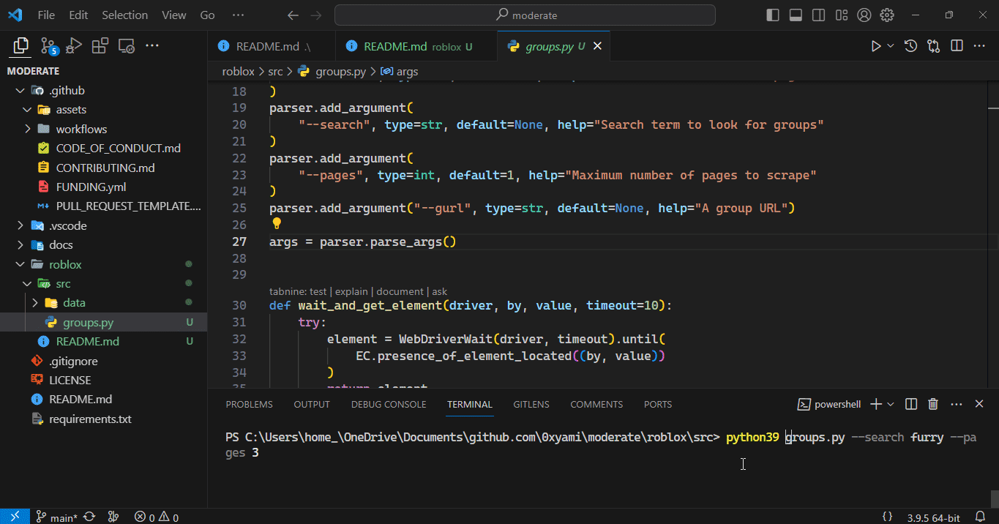

# Roblox

## `group.py` - Web Scraping Script for Roblox Groups



### Command-line Arguments

- `--timeout`: Time to wait for a page to load (default: 10 seconds).
- `--search`: Search term to look for groups.
- `--pages`: Maximum number of pages to scrape (default: 1).
- `--gurl`: A specific group URL to scrape.

### Functions

1. `wait_and_get_element(driver, by, value, timeout=10)`
    - Waits for an element specified by the `by` and `value` parameters to be present on the page.
    - Returns the located element or `None` if it times out.

2. `click_element_safely(element)`
    - Safely attempts to click on a given element, handling potential exceptions.

3. `move_to_position(driver, web_element, up=0, down=0)`
    - Scrolls the browser window to a specific position relative to the provided web element.

4. `scrape_group_details(driver, group_url, standalone=False)`
    - Scrapes details of a specific Roblox group identified by its URL.
    - Saves group details, including description, and member information to files.

5. `scrape_groups(url="https://www.roblox.com/search/groups")`
    - Scrapes Roblox groups from the specified URL or the default search URL.
    - Iterates through pages, extracts group information, and calls `scrape_group_details` for each group.

6. `main()`
    - Main function that determines whether to scrape groups or a specific group based on command-line arguments.

### Execution

1. Parsing Command-line Arguments
    - The script uses the `argparse` module to parse command-line arguments.

2. Web Scraping Initialization
    - Initializes a Chrome WebDriver for web scraping.

3. Searching for Groups
    - If `--search` is provided, the script searches for groups and iterates through pages.
    - Extracts group information such as name, URL, and access status.
    - Calls `scrape_group_details` for each group.

4. Scraping Group Details
    - `scrape_group_details` function opens the group URL, retrieves group details and saves them to files.

5. Closing the WebDriver
    - If `--autoclose` is provided, the WebDriver is closed after scraping.

6. Main Execution
    - Invokes the `main` function to start the script.

### Notes

- The script uses Selenium to automate browser actions, and BeautifulSoup for HTML parsing.
- Error handling is implemented to manage exceptions during web scraping.

### Usage Example

```bash
python group.py --search "Roblox Dev" --pages 3
```